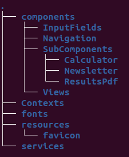
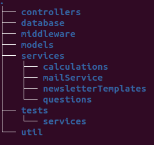
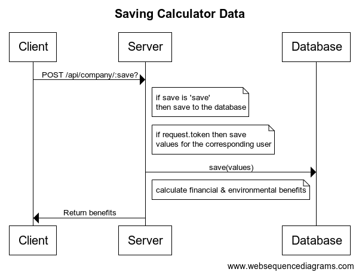

# Remote Work Now - Architecture description

## Languages and dependencies

The application has been built using Nodejs for backend and React for frontend. For a list of dependencies used, please refer to [package.json](https://github.com/RemoteSocietyNow-ohtu/remotesocietynow/blob/master/package.json).

## Folder structure

Files have been divided into folders using the client/server convention. The client folder and its subfolders contain all frontend components and the server folder all backend functionalities.

### Client

The **components** folder and its subfolders consist of React components, **context** of tools required for language versions (unimplemented in the current production version), **fonts** of the typefaces used and **resources** of all other resources (e.g. images, icons, videos, text) used in the application. **Services** contains the frontend functionality for retrieving data from the backend (e.g. GET/POST using axios).

### Server

In the server folder, **controllers** contains routers for the application's backend operations, such as returning calculator questions, newsletter management, csv file creation and returning calculator results. **Database** contains the necessary tools for managing the application's interaction with MongoDB document database. **Middleware** contains error middleware, **models** exportable mongoose database models and **services** backend functionality for calculating results, mailservice, newsletter and questions context as well as application tests and utils all utility functions not related to business logic.

## Sequence diagrams

### Saving company data

After having answered to questions in the calculator (either employee or company level) and clicking 'View results', the client posts the answers to the server. There are two alternative urls for the POST function: one with a 'save' suffix and one without. The 'save' suffix is used when the data is stored to the database, e.g. when the client posts the results for the first time  but not when the Results component is re-rendered. Re-rendering happens when the user adjusts the remote work slider on the results page, for example. The relevant code can be found [here](https://github.com/RemoteSocietyNow-ohtu/remotesocietynow/blob/master/client/services/questionService.js).

If the user is logged in, the user's [JSON Web Token](https://jwt.io/) is used to identify the user and to store the data under a specific id. 

Finally, the results are [calculated](https://github.com/RemoteSocietyNow-ohtu/remotesocietynow/blob/master/server/services/calculations/remoteWorkCalculator.js) and returned to front.

