# Remote Work Now - User's guide

## Functionalities

### Signing up as a user

On the front page, you can find a sign up button at the top-right corner of the screen. Click it.

Enter your email and password to sign up. 

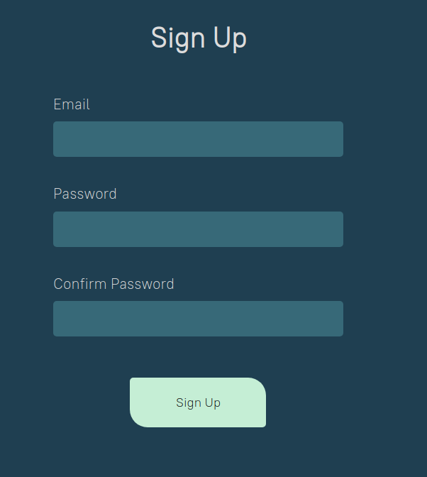

Once you have clicked sign up, you will be taken to the login screen. Input your login details, accept the use of cookies and click login.

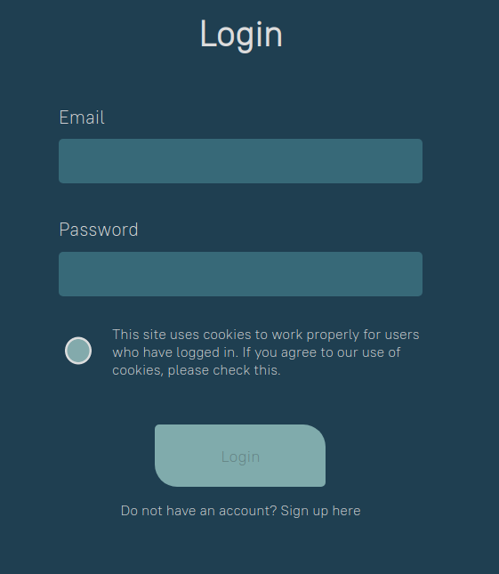

You can log out from the top-right corner of the screen.

### Using the calculators

You will be taken directly to the first calculator page after logging in. User's that have not logged in can access the calculator by clicking the Calculate benefits button on the front page.

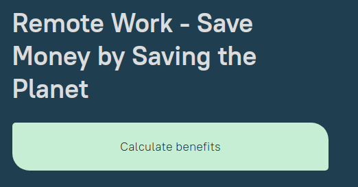

First, you must choose whether you want to calculate benefits for a company or for yourself as an individual. You can do both if you wish and the order does not matter. Please note that in order to use the calculators, you must accept the website's privacy policy.

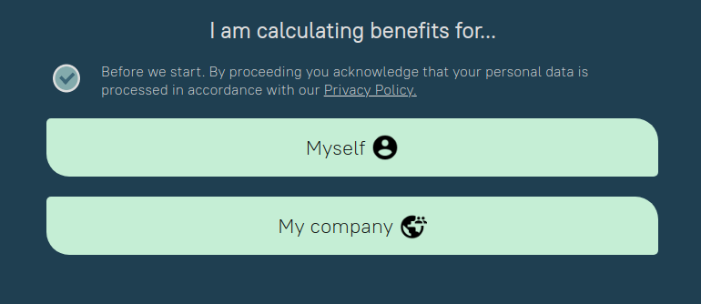

Once the calculator type has been selected, input your answers to the questions and click the right arrow button or press enter to move forward. Questions with button input you will take you to the next questions directly after clicking an answer. You can always move back by clicking the left arrow button or by selecting a question from the question bar on the right.

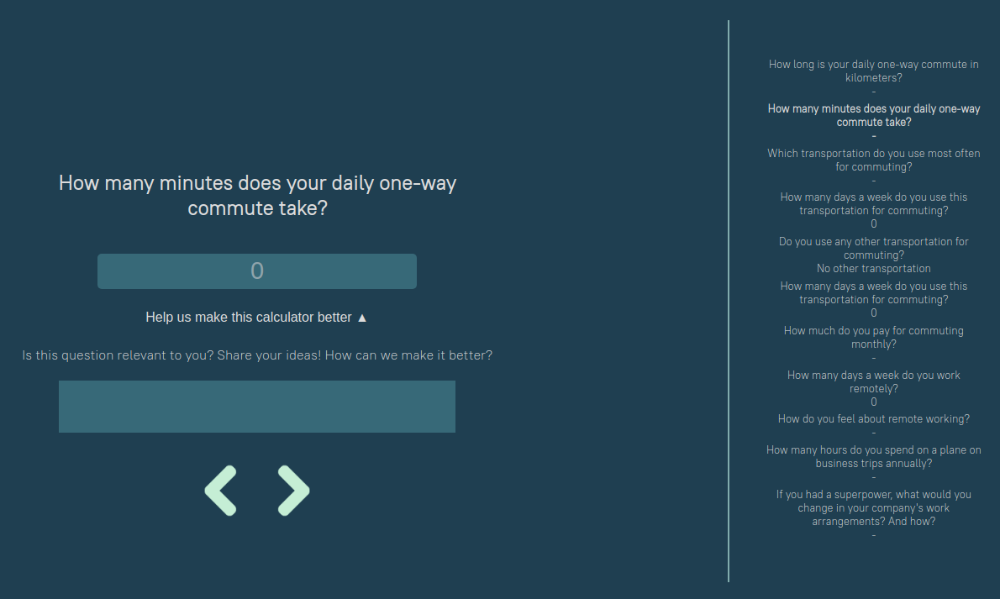

You can also give feedback of the questions. By clicking the 'Help us make this calculator better' button, a feedback field will open. All feedback is stored anonymously.

Once you are done with the questions, you can view your results by clicking 'View results'.

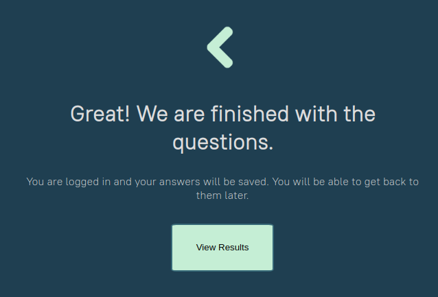

A visualization of your results is shown on the results page. You can also find more information about the calculations by clicking the 'About the math' link.

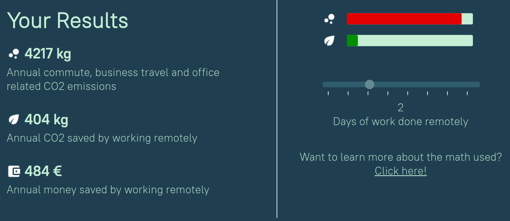

### Signing up for a newsletter

You can sign up for a newsletter from the bottom-right corner of the front page or from the results page.

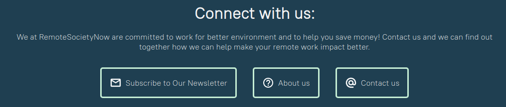

### Viewing and managing your data profile

You can view your data by clicking the 'Your Data' link in the bottom-left corner of the front page.

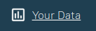

To download your data as a csv file, click the 'Download My Data' button at the bottom of the page.

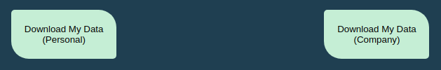

To delete your account and erase your data, click the 'Delete My Account & Data' button.

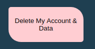

